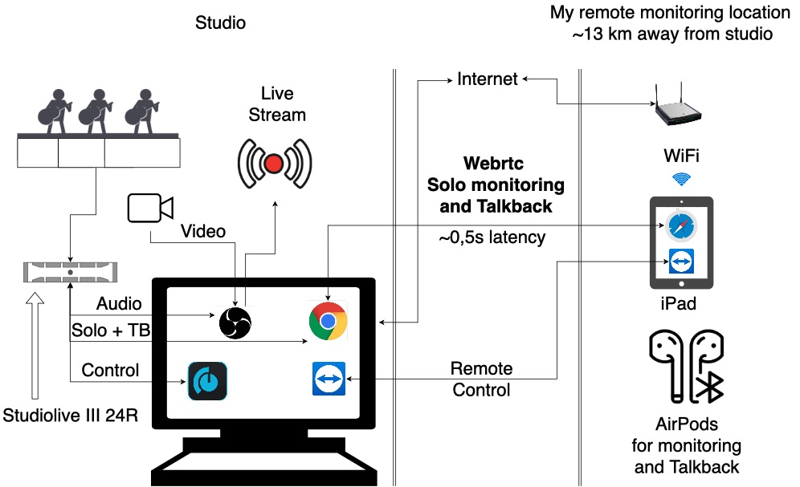

#### WebRTC One-to-Many audio sharing/broadcasting [Demo](http://romansavrulin.github.io/remote-rehearsal/)

#### Usecase

Improved audio quality! Used for live monitoring and studio talkback

=

1. This [WebRTC](https://www.webrtc-experiment.com/) experiment is aimed to transmit audio stream in one-to-many style.
2. It setups multiple peer connections to support multi-user connectivity feature. Rememebr, [WebRTC](https://www.webrtc-experiment.com/) doesn't supports 3-way handshake!
3. Out of multi-peers establishment; many RTP-ports are opened according to number of media streamas referenced to each peer connection.
4. Multi-ports establishment will cause huge [CPU and bandwidth usage](https://www.webrtc-experiment.com/docs/RTP-usage.html)!

=

If 10 users join your broadcasted room, **20 RTP ports** will be opened on your browser:

1. 10 RTP ports for **outgoing** audio streams
2. 10 RTP ports for **incoming** audio streams

=

#### Difference between one-way broadcasting and one-to-many broadcasting

For 10 users session, maximum 10 RTP ports for outgoing audio stream will be opened.

On each participant's side; only one **incoming** RTP port will be opened.

Unlike one-way broadcasting; one-to-many broadcasting experiment opens both outgoing as well as incoming RTP ports for each participant.

=

For signaling; please check following page:

https://github.com/muaz-khan/WebRTC-Experiment/blob/master/Signaling.md

Remember, you can use any signaling implementation exists out there without modifying any single line! Just skip below code and open [above link](https://github.com/muaz-khan/WebRTC-Experiment/blob/master/Signaling.md)!

=

#### Browser Support 

This [WebRTC Audio Broadcasting Experiment](https://www.webrtc-experiment.com/audio-broadcast/) works fine on following web-browsers:

| Browser        | Support           |
| ------------- |-------------|
| Firefox | [Stable](http://www.mozilla.org/en-US/firefox/new/) / [Aurora](http://www.mozilla.org/en-US/firefox/aurora/) / [Nightly](http://nightly.mozilla.org/) |
| Google Chrome | [Stable](https://www.google.com/intl/en_uk/chrome/browser/) / [Canary](https://www.google.com/intl/en/chrome/browser/canary.html) / [Beta](https://www.google.com/intl/en/chrome/browser/beta.html) / [Dev](https://www.google.com/intl/en/chrome/browser/index.html?extra=devchannel#eula) |
| Android | [Chrome Beta](https://play.google.com/store/apps/details?id=com.chrome.beta&hl=en) |

=

#### License

WebRTC [Audio Broadcasting Experiment](https://www.webrtc-experiment.com/audio-broadcast/) is released under [MIT licence](https://www.webrtc-experiment.com/licence/) . Copyright (c) 2013 [Muaz Khan](https://plus.google.com/100325991024054712503).
